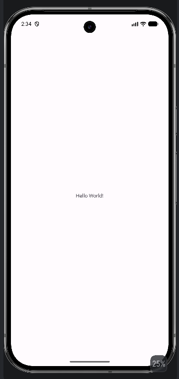
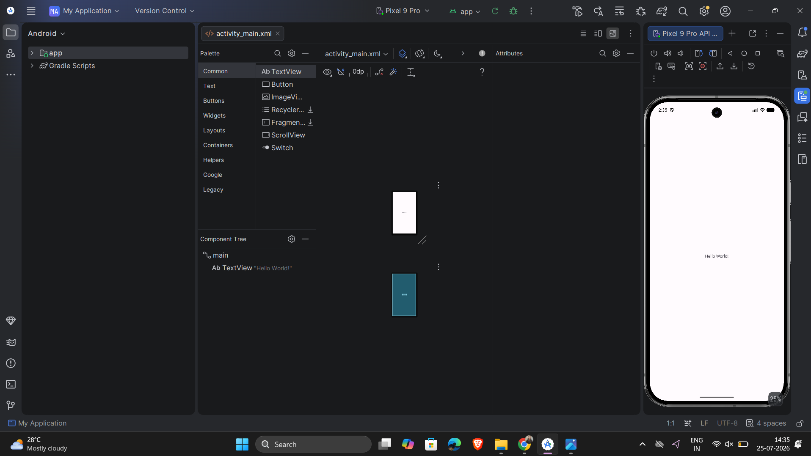
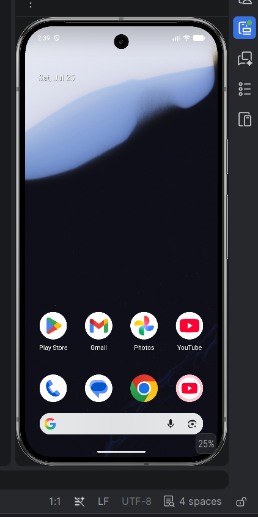
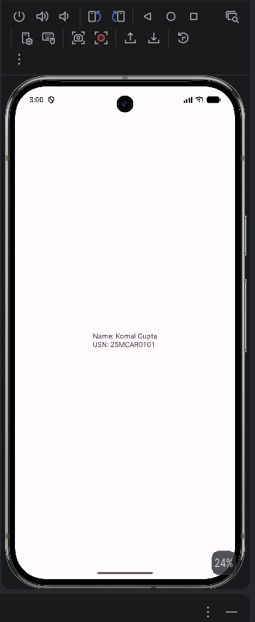

#  Experiment 01 - Hello World Application

## Student Details

- **Name:** Komal Gupta
- **USN:** 25MCAR0101
- **Course:** Mobile Application Development Lab
- **Experiment No:** 01

---

## Aim

To install Android Studio, configure the Android SDK, create the first Android application, and execute it successfully on an Android Emulator.

---

## Theory

Android Studio is Google's official IDE for Android application development. It provides an integrated environment for writing Kotlin/Java code, designing XML layouts, debugging applications, and testing them using an Android Emulator or a physical device.

In this experiment, a simple Hello World application is developed to understand the Android project structure and application execution process.

---

## Technology Used

- Android Studio
- Kotlin
- XML
- Android SDK
- Android Emulator
- Gradle

---

## Project Structure

```
Experiment-01
│
├── README.md
├── Source-Code
│   └── MyApplication
├── Screenshots
│   ├── Output.png
│   ├── TestCase1.png
│   ├── TestCase2.png
│   └── TestCase3.png
```

---

## Steps Performed

1. Installed Android Studio.
2. Installed Android SDK.
3. Created a new Android project.
4. Selected Empty Activity.
5. Used Kotlin as the programming language.
6. Created an Android Virtual Device (AVD).
7. Executed the application.
8. Verified the output.

---
## Output

The application displays the text:

**Hello World!**

### Output Screenshot




---

## Test Cases

### Test Case 1

**Input:** Run the application.

**Expected Output:** Application launches successfully.

**Actual Output:** Passed.



---

### Test Case 2

**Input:** Verify Hello World text.

**Expected Output:** Text should appear on screen.

**Actual Output:** Passed.



---
### Test Case 3

**Input:** Display Student Name and USN on the screen.

**Expected Output:** Student Name and USN should be visible.

**Actual Output:** Passed.




---

## Conclusion
The objective of this experiment was achieved successfully. Android Studio was installed and configured, the Android SDK and Emulator were set up, and the first Android application displaying "Hello World!" was developed and executed successfully.
