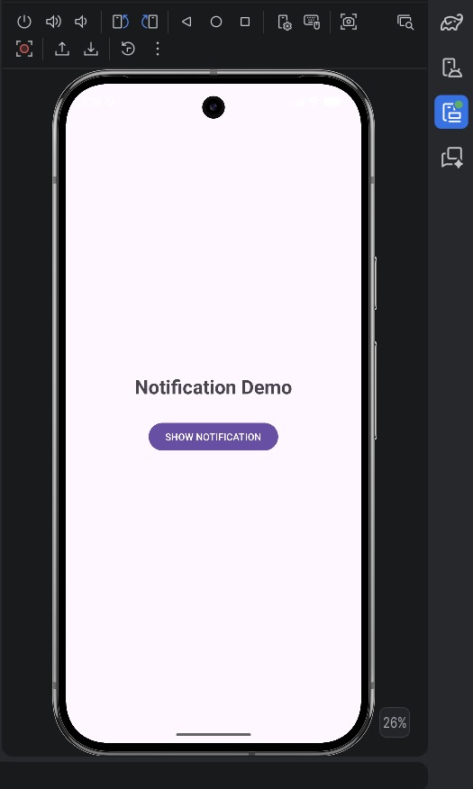
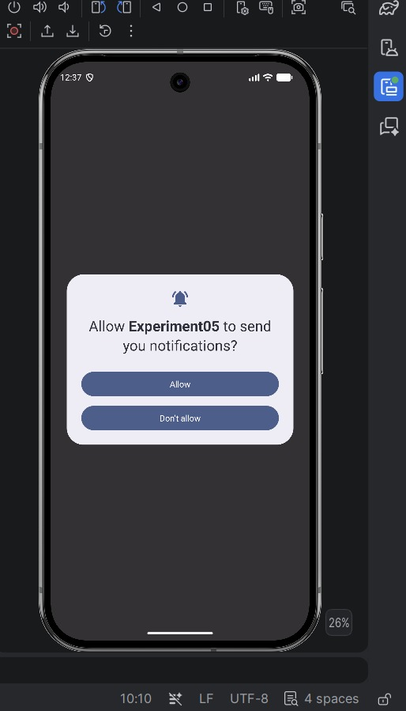
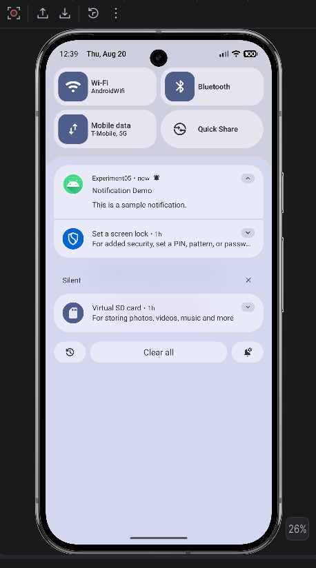

# Experiment 05: Displaying Notifications in Android

## Objective

To develop an Android application that demonstrates how to create and display notifications using the Android Notification API.

## Description

This experiment demonstrates the implementation of notifications in an Android application.

The application creates a notification channel and displays a notification when the notification action is triggered. It demonstrates notification channels, notification titles, notification messages, notification icons, and notification permissions.

The application is developed using **Kotlin** in **Android Studio**.

## Features

- Simple and user-friendly interface
- Notification Channel creation
- Notification title and message
- Notification icon
- Notification panel integration
- Notification permission handling
- Android notification management

## Technologies Used

- **Android Studio**
- **Kotlin**
- **XML**
- **Android SDK**
- **NotificationManager**
- **NotificationChannel**

## Application Flow

```text
Launch Application
        ↓
Display Application Interface
        ↓
Trigger Notification
        ↓
Create Notification Channel
        ↓
Build Notification
        ↓
NotificationManager
        ↓
Display Notification
        ↓
Notification Appears in Notification Panel
```

## Main Components

### MainActivity

`MainActivity` handles the main application interface and notification functionality.

It creates the notification channel and triggers the notification when the user performs the notification action.

### NotificationChannel

`NotificationChannel` is used to create and manage a notification channel for Android 8.0 (API level 26) and above.

### NotificationManager

`NotificationManager` is used to issue and display notifications on the Android device.

## Notification Permission

For Android 13 (API level 33) and above, notification permission is required.

```xml
<uses-permission android:name="android.permission.POST_NOTIFICATIONS" />
```

The application requests the required notification permission before displaying notifications when necessary.

## Screenshots

### 1. Application Interface



### 2. Notification Display



### 3. Notification Panel



## Result

The Android application was successfully developed and tested. The application successfully generates and displays notifications in the Android notification panel.

## Conclusion

This experiment provided practical knowledge of implementing notifications in Android applications using Kotlin. It demonstrated the use of `NotificationChannel`, `NotificationManager`, notification permissions, and notification components to create and display notifications.

## Learning Outcomes

After completing this experiment, the following concepts were understood:

- Understanding Android notification architecture
- Creating and managing notification channels
- Using `NotificationManager`
- Handling notification permissions
- Building and displaying notifications
- Testing notifications using an Android emulator

## Project Structure

```text
Experiment-05/
│
├── README.md
├── AndroidManifest.xml
├── MainActivity.kt
├── activity_main.xml
├── screenshot1.png
├── screenshot2.png
└── screenshot3.png
```

## Experiment Details

| Details | Information |
|---|---|
| Experiment | 05 |
| Topic | Displaying Notifications in Android |
| Language | Kotlin |
| UI | XML |
| Platform | Android |
| IDE | Android Studio |
| SDK | Android SDK |
