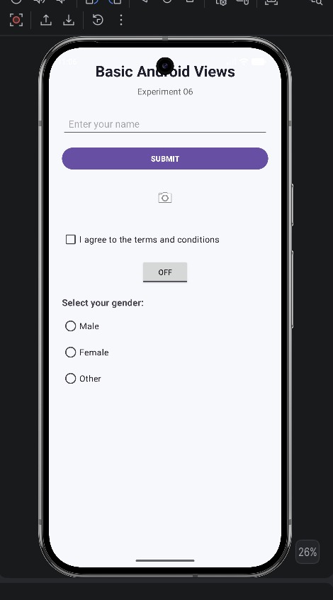
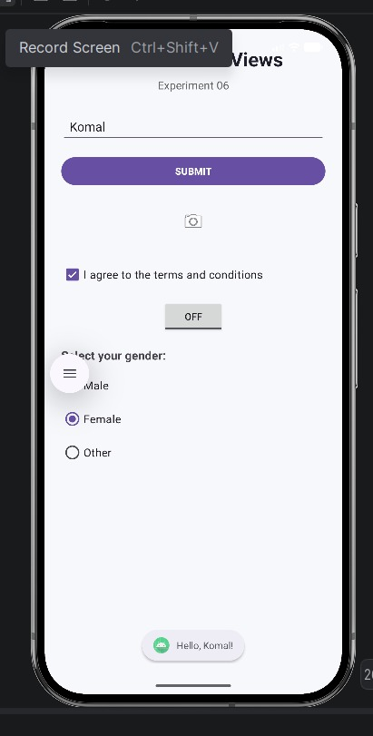

# Experiment 06: Basic Android Views

## Aim

To create an Android application using basic Views such as TextView, EditText, Button, ImageButton, CheckBox, ToggleButton, RadioButton, and RadioGroup.

## Objective

The objective of this experiment is to understand the use of basic Android UI components and implement their functionality using Kotlin and XML.

## Description

This experiment demonstrates the implementation of commonly used Android Views in a simple user interface.

The application contains a TextView for displaying text, an EditText for accepting user input, a Button for performing an action, an ImageButton, a CheckBox, a ToggleButton, and a RadioGroup containing multiple RadioButtons.

The application is developed using Kotlin in Android Studio with XML for designing the user interface.

## Views Used

- **TextView** – Displays text on the screen.
- **EditText** – Allows the user to enter text.
- **Button** – Performs an action when clicked.
- **ImageButton** – Displays an image-based clickable button.
- **CheckBox** – Allows the user to select or deselect an option.
- **ToggleButton** – Provides ON/OFF functionality.
- **RadioButton** – Allows selection of one option.
- **RadioGroup** – Groups multiple RadioButtons together.

## Technologies Used

- Android Studio
- Kotlin
- XML
- Android SDK

## Application Features

- User-friendly Android interface
- Text display using TextView
- User input using EditText
- Button click handling
- ImageButton interaction
- Checkbox selection
- Toggle ON/OFF functionality
- RadioButton selection
- RadioGroup handling
- Toast messages for user interactions

## Application Flow

```text
Launch Application
        ↓
Display Basic Android Views
        ↓
Enter Name
        ↓
Click Submit
        ↓
Display Toast Message
        ↓
Interact with ImageButton
        ↓
Select/Deselect CheckBox
        ↓
Toggle ON/OFF
        ↓
Select RadioButton
        ↓
Display Selected Option
## Screenshots

### Screenshot 1 – Application Interface



### Screenshot 2 – Application Interaction


