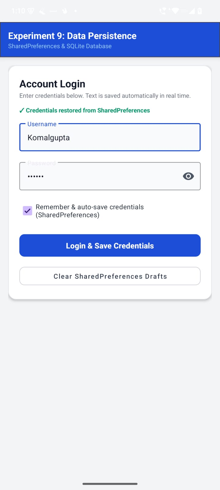
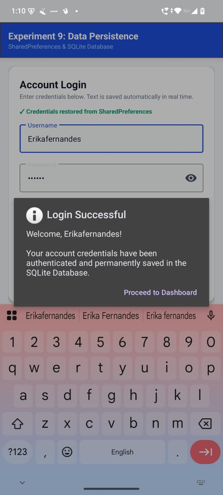
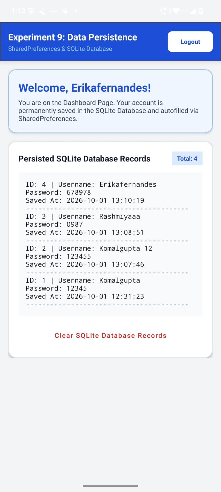

# Experiment 09 – Data Persistence using SharedPreferences and SQLite

## 📌 Experiment Title

**Develop an Android application that demonstrates data persistence by using SharedPreferences for storing key-value pairs and SQLite for creating and managing databases.**

---

## 🎯 Objective

The objective of this experiment is to develop an Android application that
demonstrates data persistence using **SharedPreferences** and **SQLite
Database**.

The application allows the user to:

- Save username and password persistently.
- Automatically restore saved login credentials.
- Store every successful login in SQLite.
- Maintain multiple login records.
- Display stored records from the SQLite database.
- Logout without deleting stored database records.

---

## 📱 Application Name

**Experiment 9 – Data Persistence**

The application demonstrates two different approaches to storing data in an
Android application:

- **SharedPreferences** – for simple key-value data persistence.
- **SQLite Database** – for storing and managing multiple structured records.

---

## ✨ Features

### 🔐 1. Persistent Login Credentials

The application saves the entered username and password using
**SharedPreferences**.

When the application is opened again, the previously saved credentials are
automatically restored into the login fields.

---

### ⚡ 2. Automatic Credential Fill

Previously saved username and password are automatically filled in the
login form.

This demonstrates persistent key-value storage using SharedPreferences.

---

### 🗄️ 3. SQLite Database

Every successful login is stored as a new record in the SQLite database.

The database stores:

- ID
- Username
- Password
- Saved Date and Time

Previous login records are not deleted or replaced when a new login is
performed.

---

### 🚪 4. Logout Functionality

A **Logout** button is available in the top-right corner of the dashboard.

When the user logs out:

- The user returns to the login screen.
- Existing SQLite records remain stored.
- Previous login history is preserved.

---

### 📊 5. Display SQLite Records

The dashboard displays the records stored in the SQLite database.

The application also displays the total number of stored records.

Multiple successful logins create multiple records in the database.

---

## 🛠️ Technologies Used

| Technology | Purpose |
|---|---|
| Android Studio | Android application development |
| Kotlin | Programming language |
| XML | User interface design |
| Android SDK | Android development framework |
| SharedPreferences | Persistent key-value storage |
| SQLite | Local database storage |
| SQLiteOpenHelper | SQLite database creation and management |

---

## 🧩 Main Components

| Component | Purpose |
|---|---|
| `MainActivity.kt` | Handles application logic and user interactions |
| `SharedPreferences` | Saves and restores username/password |
| `SQLiteOpenHelper` | Creates and manages SQLite database |
| `EditText` | Accepts username and password |
| `Button` | Handles login and logout operations |
| SQLite Table | Stores multiple login records |
| Dashboard | Displays persisted database records |

---

## 🗃️ SQLite Database Structure

The SQLite database maintains every successful login as a separate record.

| Column | Description |
|---|---|
| ID | Unique identifier for each record |
| Username | Username entered during login |
| Password | Password entered during login |
| Saved At | Date and time when the record was saved |

---

# 📸 Screenshots

## 🔐 Login Screen

The login screen allows the user to enter username and password. 
Previously saved credentials are automatically restored using SharedPreferences.

<p align="center">
  
</p>

---

## ✅ Login Successful

After successful login, the entered credentials are stored as a new record 
in the SQLite database.

<p align="center">
  
</p>

---

## 🗄️ SQLite Database Dashboard

The dashboard displays all login records stored permanently in the SQLite 
database. Each successful login is stored as a separate record.

<p align="center">
  
</p>

---

# 🏁 Conclusion

This experiment demonstrates data persistence in Android using two different
storage mechanisms:

- **SharedPreferences** for key-value data and automatic credential restoration.
- **SQLite Database** for storing and managing multiple login records.

The application successfully preserves login credentials, provides automatic
credential filling, stores every successful login permanently, and provides
a logout option from the dashboard.

### Example Record

```text
ID: 1
Username: Komalgupta
Password: *****
Saved At: 2026-10-01 12:31:23
