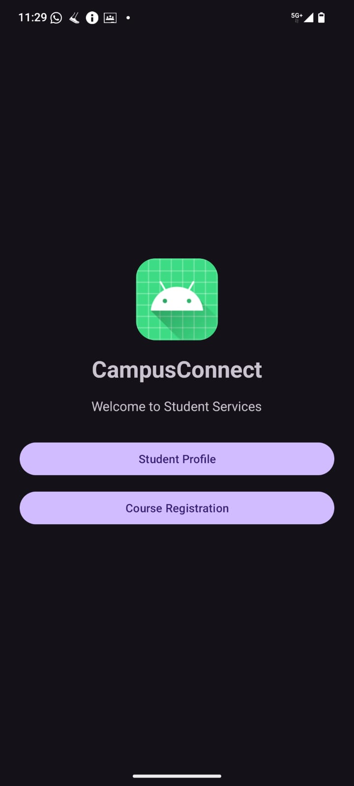
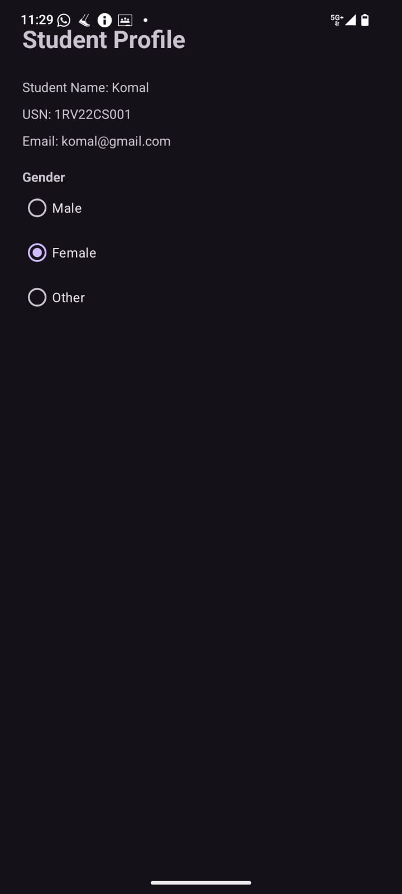
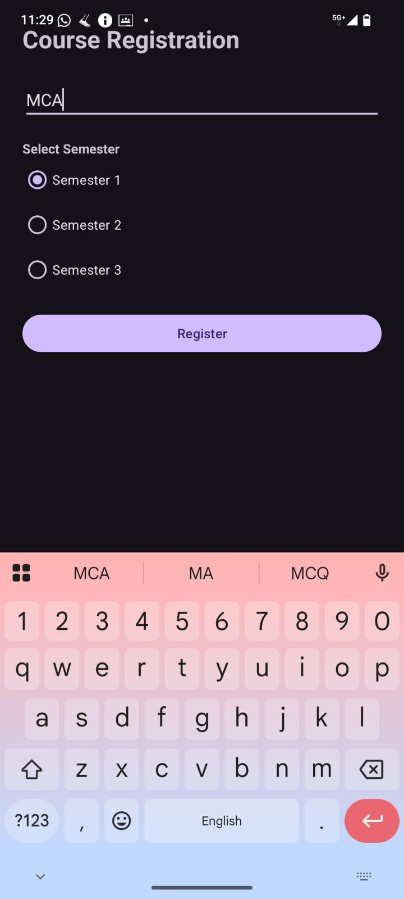
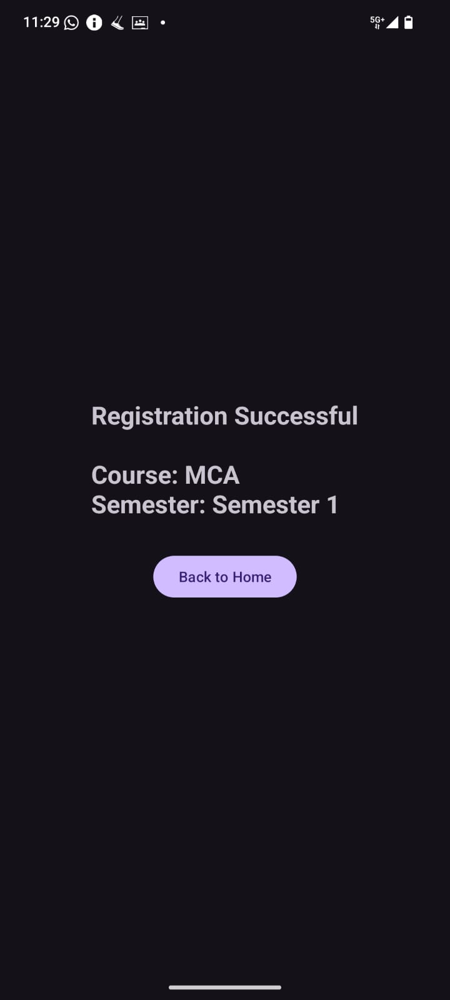
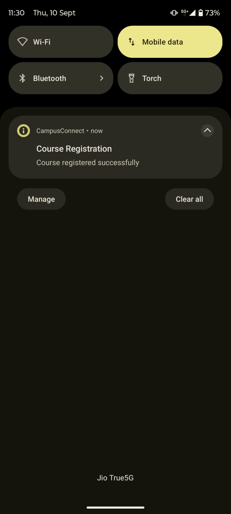

#  CampusConnect – Student Service

## Mobile Application Development – Test 01

**CampusConnect** is a scenario-based Android application developed to provide students with basic campus services. The application demonstrates the use of **Activities, Fragments, Intents, Android UI components, Activity Lifecycle methods, and Notifications**.

---

##  Aim

To develop and demonstrate an Android application named **CampusConnect** that allows students to view their profile and register for a course using Android **Activities, Fragments, Intents, UI components, Activity Lifecycle methods, and Notifications**.

---

##  Technologies Used

- **Android Studio**
- **Kotlin**
- **XML**
- **Android SDK**
- **Gradle**
- **Android Logcat**

---

##  Application Features

###  1. Home Activity

The Home screen provides access to the main student services.

- CampusConnect application logo
- Application name
- Welcome message
- Student Profile button
- Course Registration button

###  2. Student Profile Fragment

The Student Profile Fragment displays:

- Student Name
- USN
- Email
- Gender selection using RadioButton and RadioGroup

###  3. Course Registration Fragment

The Course Registration Fragment allows students to:

- Enter a course name
- Select a semester
- Register for the selected course

UI components used:

- EditText
- RadioGroup
- RadioButton
- Button

###  4. Intent-Based Navigation

After registration, an **Intent** transfers the selected course name and semester from the Course Registration Fragment to the Confirmation Activity.

###  5. Registration Confirmation Activity

The Confirmation Activity displays:

- Registration Successful message
- Selected course
- Selected semester
- Back to Home button

###  6. Android Notification

After successful registration, the application generates an Android notification:

**Course Registration**  
**Course registered successfully**

###  7. Activity Lifecycle

The application demonstrates Android Activity Lifecycle methods:

```text
onCreate()
    ↓
onStart()
    ↓
onResume()
    ↓
onPause()
    ↓
onStop()
    ↓
onDestroy()
```

Lifecycle events can be monitored using **Android Logcat**.

---

##  Application Flow

```text
                    HOME ACTIVITY
                         │
              ┌──────────┴──────────┐
              ↓                     ↓
      STUDENT PROFILE       COURSE REGISTRATION
         FRAGMENT                  FRAGMENT
                                    │
                              Enter Course
                                    +
                             Select Semester
                                    │
                                    ↓
                                REGISTER
                                    │
                                    ↓
                         CONFIRMATION ACTIVITY
                                    │
                       ┌────────────┴────────────┐
                       ↓                         ↓
              Registration Result        Android Notification
                       │
                       ↓
                  Back to Home
```

---

##  Project Structure

```text
CampusConnect/
│
├── app/
│   └── src/main/
│       ├── java/com/example/campusconnect/
│       │   ├── MainActivity.kt
│       │   ├── ProfileFragment.kt
│       │   ├── CourseRegistrationFragment.kt
│       │   └── ConfirmationActivity.kt
│       │
│       ├── res/
│       │   └── layout/
│       │       ├── activity_main.xml
│       │       ├── fragment_profile.xml
│       │       ├── fragment_course_registration.xml
│       │       └── activity_confirmation.xml
│       │
│       └── AndroidManifest.xml
│
└── README.md
```

---

#  Application Screenshots

The following screenshots demonstrate the working flow of the CampusConnect Android application.

## 1.  Home Screen

The Home Activity provides navigation to Student Profile and Course Registration.



---

## 2.  Student Profile

The Student Profile Fragment displays the student's name, USN, email, and gender selection.



---

## 3.  Course Registration

The Course Registration Fragment allows the student to enter a course name and select a semester.



---

## 4.  Registration Successful

After clicking the Register button, the Confirmation Activity displays the successful registration details.

**Course:** MCA  
**Semester:** Semester 1



---

## 5.  Registration Notification

After successful registration, the application generates an Android notification confirming the course registration.



---

#  Test Case

### Test Input

```text
Course Name : MCA
Semester    : Semester 1
```

### Expected Output

```text
Registration Successful

Course: MCA
Semester: Semester 1
```

The application also generates a notification confirming that the course was registered successfully.

---

##  How to Run

1. Open the project in **Android Studio**.
2. Wait for Gradle synchronization to complete.
3. Connect an Android device or start an Android Emulator.
4. Select the device.
5. Click **Run ▶**.
6. Open **Student Profile** to view student details.
7. Open **Course Registration**.
8. Enter the course name.
9. Select a semester.
10. Click **Register**.
11. Verify the registration confirmation.
12. Check the Android notification.
13. Check lifecycle events using **Logcat**.

---

##  Result

The **CampusConnect – Student Service** Android application was successfully developed and tested.

The application demonstrates:

- Activity
- Fragment
- Intent
- EditText
- Button
- RadioButton
- RadioGroup
- Activity Lifecycle
- Android Notification
- Logcat

---

##  Conclusion

The project provides practical understanding of Android application development by integrating multiple Android components into a single scenario-based application.

It successfully implements student profile viewing, course registration, Intent-based navigation, registration confirmation, Activity Lifecycle logging, and Android notification generation.

---

##  Project Information

| Item | Details |
|---|---|
| Project | CampusConnect – Student Service |
| Test | Test 01 |
| Platform | Android |
| Language | Kotlin |
| UI | XML |
| IDE | Android Studio |
| Application Type | Student Service Application |

---

##  Screenshot Files

Keep the README and the five screenshot files in the **same Test-01 folder**:

```text
Test-01/
├── README.md
├── home.png
├── profile.png
├── course-registration.png
├── confirmation.png
└── notification.png
```

> **Important:** The screenshot names must match the names used above so that GitHub displays all five images directly inside the README.
